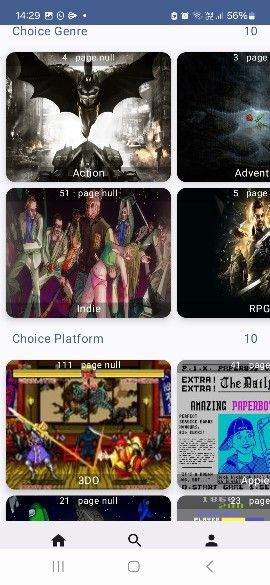
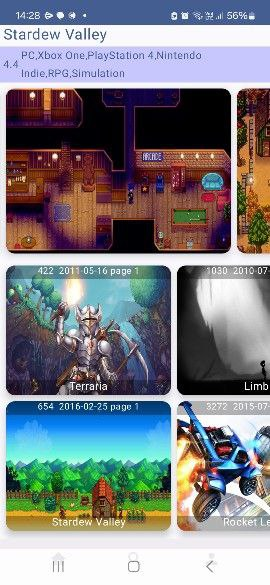

# JetGameWorld

## Android aplication for Explore RAWG Video Games Database API

#### _Offline mode support_
#### _open API  - <code>[Rawg Video Games Api](hhttps://rawg.io/apidocs)</code>_

## Technology Stack:
- language Kotlin
- UI на Jetpack Compose
- Single Activity Application pattern
- MVVM 
- navigation Jetpack Navigation
- Paging 3 
- RemoteMediator
- SwipeRefresh, Accompanist.
- MultiModules
- Dagger Hilt 
- Kotlin Coroutines + Flow
- Retrofit + Kotlin Serialization 
- Room

## Feature:
### 1. Main Screen - choice Genre, Platform. See lists with Games Plastation 4 , Popular, Released, Nintendo Switch, Last Year    

### 1. Detail Screen with seven picture of game

### 7. Launch

#### For Launch, get Api Key and add in local.properties API_KEY=